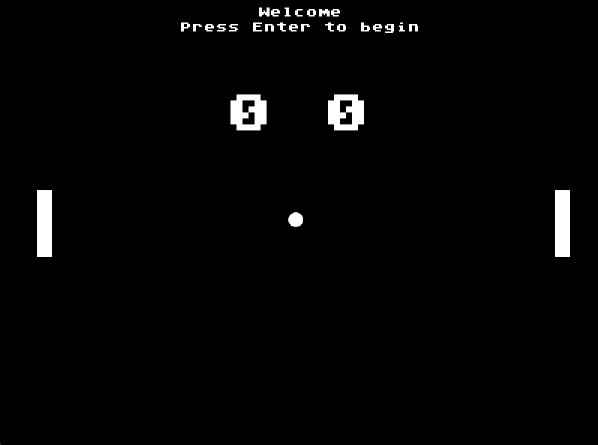
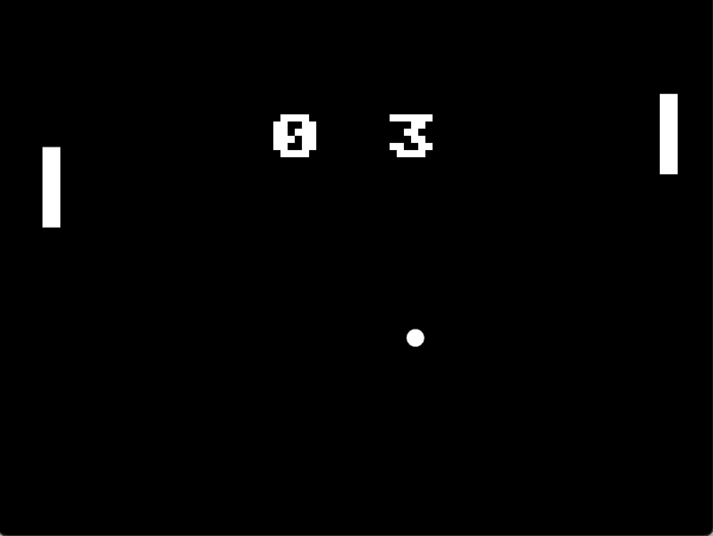
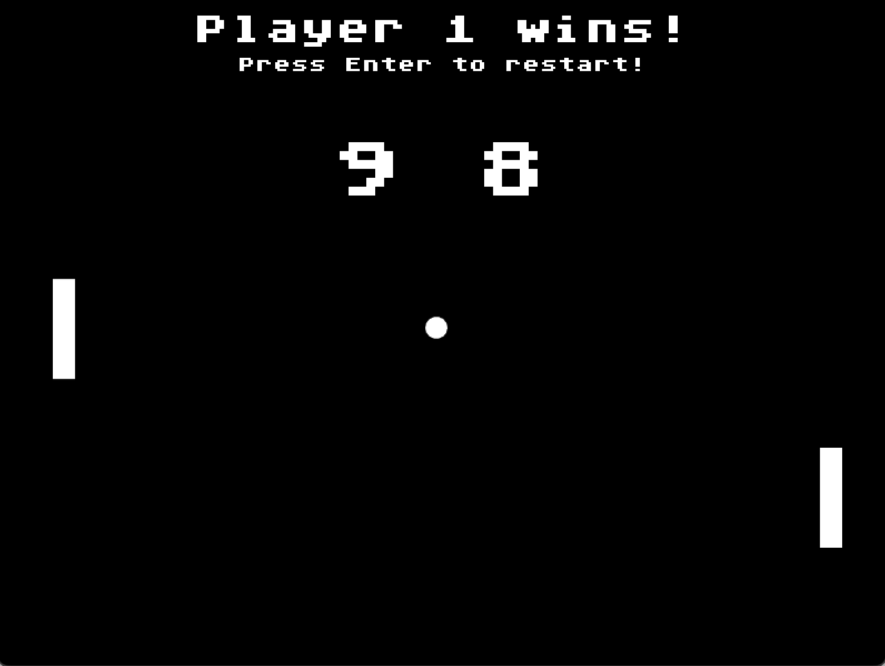

# Ping-Pong

[Разработать игру](https://ru.wikipedia.org/wiki/Pong_(%D0%B8%D0%B3%D1%80%D0%B0)).

В игре должно быть реализовано:

1. Четыре экрана: приветствие, игра, поражение и победа;

2. Должен быть счет, игра ведется до 9 очков;

3. Шарик и ракетки не должны выходить за поле;

4. Вторая ракетка управляется автоматически (но должна допускать поражение);

5. Игра ускоряется по мере набирания очков.

## Скриншоты

|  |
| -------------------- |
|   |
|    |

